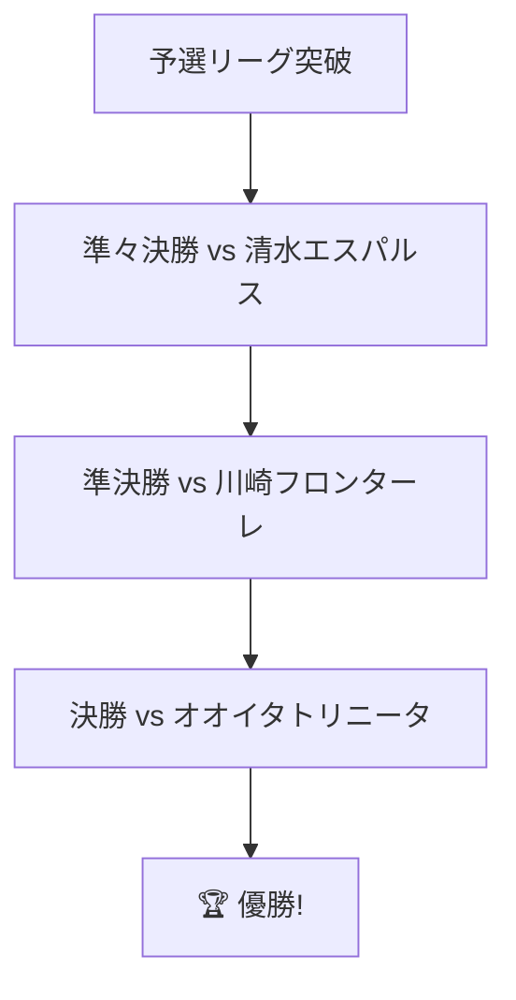

# 🔵⚽ 大分トリニータ歴史物語 ⚽🔵

_青と黄色に込められた夢と情熱の 30 年_

---

## 📋 目次

-   [🏆 クラブ概要](#-クラブ概要)
-   [📅 年表で見るトリニータの軌跡](#-年表で見るトリニータの軌跡)
-   [⭐ 黄金期とナビスコカップ優勝](#-黄金期とナビスコカップ優勝)
-   [💪 困難を乗り越えた経営危機](#-困難を乗り越えた経営危機)
-   [🎯 戦術革命「カメナチオ」](#-戦術革命カメナチオ)
-   [👨‍💼 歴代指導者たち](#-歴代指導者たち)
-   [⚽ レジェンドたち](#-レジェンドたち)
-   [🏟️ ホームスタジアムの歴史](#️-ホームスタジアムの歴史)
-   [📊 成績データ](#-成績データ)
-   [🎉 サポーター文化](#-サポーター文化)
-   [🚀 未来への展望](#-未来への展望)

---

## 🏆 クラブ概要

| 項目                 | 詳細                                                                                                                                    |
| -------------------- | --------------------------------------------------------------------------------------------------------------------------------------- |
| **正式名称**         | 大分トリニータ                                                                                                                          |
| **創設年**           | 1994 年                                                                                                                                 |
| **ホームタウン**     | 大分県大分市                                                                                                                            |
| **ホームスタジアム** | クラサスドーム大分                                                                                                                      |
| **収容人数**         | 約 20,000 人                                                                                                                            |
| **チームカラー**     |  青  黄色 |
| **現在のリーグ**     | J2 リーグ                                                                                                                               |
| **愛称**             | トリニータ                                                                                                                              |

> **"Trinity"（三位一体）** - クラブ、サポーター、地域が一体となって目指す理想を表現

---

## 📅 年表で見るトリニータの軌跡

### 🌱 創設期（1990 年代）

-   **1994 年** 🎂 大分トリニータ発足

    -   大分県初のプロサッカークラブとして誕生
    -   九州リーグからスタート

-   **1999 年** 📈 JFL 昇格
    -   着実な成長を見せ、全国レベルへ

### 🚀 J リーグ時代の幕開け（2000 年代前期）

-   **2002 年** 🎊 **J2 リーグ昇格**

    -   ついに J リーグの仲間入り！
    -   大分県サッカー界の歴史的瞬間

-   **2004 年** ⬆️ **J1 昇格**
    -   わずか 2 年で J1 の舞台へ
    -   九州のサッカーファンが歓喜

### ⭐ 黄金期（2000 年代後期）

-   **2008 年** 🏆 **ナビスコカップ優勝**
    -   クラブ史上初、九州初のタイトル獲得
    -   「カメナチオ」戦術で日本中を魅了

### 🌊 試練の時代（2010 年代）

-   **2012 年** ⬇️ J2 降格
-   **2014 年** ⬇️ J3 降格
    -   経営危機と戦いながらも、サポーターは離れず

### 🌅 復活への道（2010 年代後期〜現在）

-   **2017 年** ⬆️ J2 復帰
-   **2024 年** 📊 J2 リーグ 16 位
    -   新体制での再建中

---

## ⭐ 黄金期とナビスコカップ優勝

### 🏆 2008 年の奇跡

2008 年のナビスコカップ優勝は、大分トリニータの歴史において最も輝かしい瞬間でした。

#### 決勝への道のり



#### 決勝戦ハイライト

**日時**: 2008 年 11 月 3 日
**会場**: 国立競技場
**対戦相手**: 清水エスパルス
**結果**: **大分トリニータ 1-0 清水エスパルス**

| 時間       | 出来事                        |
| ---------- | ----------------------------- |
| 前半 35 分 | **⚽ 西澤明訓ゴール**         |
| 後半       | 守備陣の奮闘で 1 点を守り切る |
| 試合終了   | 🎉 **歴史的勝利！**           |

> **西澤明訓選手のコメント** > _「大分のサポーターの皆さんのおかげです。この優勝を大分県民全員で分かち合いたい」_

---

## 💪 困難を乗り越えた経営危機

### 📉 危機の時代

| 年度    | 状況                | 対策                   |
| ------- | ------------------- | ---------------------- |
| 2012 年 | J2 降格、観客数減少 | ~~給与カット~~         |
| 2013 年 | スポンサー離れ      | **新規スポンサー開拓** |
| 2014 年 | J3 降格             | ✅ クラブ再生計画策定  |

### 🤝 地域との絆

経営危機の中でも、大分県民とサポーターは変わらぬ愛情を注ぎ続けました：

-   [x] サポーター有志による寄付活動
-   [x] 地元企業による継続的支援
-   [x] 自治体との連携強化
-   [ ] ~~諦めるという選択肢~~ （決して考えなかった！）

---

## 🎯 戦術革命「カメナチオ」

### 📖 カメナチオとは

**カメナチオ（Camenaccio）** = カテナチオ + 大分の方言「かめな」（頑張れ）

#### 戦術の特徴

1. **堅守速攻**

    - 組織的な守備ブロック
    - カウンターアタックの精度

2. **規律ある戦術**

    - 選手全員が戦術を理解
    - 90 分間継続される集中力

3. **大分らしさ**
    - 泥臭いプレーも厭わない
    - 最後まで諦めない姿勢

```
     GK
   CB  CB  CB
LWB           RWB
   CDM   CDM
      CAM
   ST    ST
```

_カメナチオの基本フォーメーション_

---

## 👨‍💼 歴代指導者たち

### 🌟 印象に残る監督たち

#### ペリクレス・シャムスカ監督

-   **在任期間**: 2007-2009 年
-   **主な功績**: ナビスコカップ優勝
-   **戦術**: カメナチオの確立

#### その他の名監督

| 監督名     | 在任期間  | 特徴             |
| ---------- | --------- | ---------------- |
| ウィル監督 | 2004-2005 | J1 昇格の立役者  |
| 西野朗監督 | 2009-2010 | 日本代表経験豊富 |

---

## ⚽ レジェンドたち

### 🏅 クラブの象徴的選手

#### 西澤明訓（元日本代表 FW）

-   **在籍期間**: 2007-2011 年
-   **主な記録**:
    -   ナビスコカップ決勝ゴール ⚽
    -   クラブ通算 ○○ ゴール
    -   日本代表キャップ数: 38 試合

#### その他のレジェンド

<details>
<summary>📂 歴代主要選手一覧</summary>

-   **GK**: 大井健太郎
-   **DF**: 加藤久、清武功暉
-   **MF**: 松井大輔、清武弘嗣
-   **FW**: 皇甫貞訓、小松塁

</details>

---

## 🏟️ ホームスタジアムの歴史

### 🏛️ クラサスドーム大分

**正式名称**: 大分スポーツ公園総合競技場
**通称**: クラサスドーム大分
**開場**: 2001 年

#### スタジアムの特徴

-   **ドーム型屋根** 🏠

    -   九州初の開閉式屋根
    -   天候に左右されない試合環境

-   **最新設備** 🔧
    -   LED 照明システム
    -   最新の芝生管理技術

#### 座席配置

```
    [ゴール側]
[メイン] 🏟️ [バック]
    [ゴール側]
```

| スタンド       | 収容人数    | 特徴                   |
| -------------- | ----------- | ---------------------- |
| メインスタンド | 約 8,000 席 | VIP 席、報道席         |
| バックスタンド | 約 7,000 席 | アウェイサポーター席   |
| ゴール裏       | 約 5,000 席 | ホームサポーター応援席 |

---

## 📊 成績データ

### 📈 リーグ戦績推移

#### J1 在籍時の成績

| シーズン | 順位  | 勝  | 分  | 負  | 得点 | 失点 | 勝点 |
| -------- | ----- | --- | --- | --- | ---- | ---- | ---- |
| 2004     | 12 位 | 11  | 11  | 12  | 42   | 46   | 44   |
| 2005     | 16 位 | 9   | 11  | 14  | 37   | 47   | 38   |
| 2008     | 9 位  | 12  | 10  | 12  | 35   | 37   | 46   |
| 2009     | 11 位 | 11  | 9   | 14  | 39   | 49   | 42   |

#### 📊 カップ戦成績

-   **ナビスコカップ**: 🏆 **優勝 1 回**（2008 年）
-   **天皇杯**: ベスト 8（複数回）
-   **J1 昇格プレーオフ**: 出場 2 回

### 📉 最近の動向（2020-2024）

```python
# 成績推移グラフ（イメージ）
years = [2020, 2021, 2022, 2023, 2024]
positions = [18, 15, 12, 14, 16]

print("📈 順位推移:")
for year, pos in zip(years, positions):
    print(f"{year}年: {pos}位 {'📈' if pos < 15 else '📉'}")
```

**出力例:**

```
📈 順位推移:
2020年: 18位 📉
2021年: 15位 📉
2022年: 12位 📈
2023年: 14位 📉
2024年: 16位 📉
```

---

## 🎉 サポーター文化

### 🎵 応援歌・チャント

#### 代表的な応援歌

**"青と黄色の翼に乗って"**

```
🎵 青と黄色の翼に乗って
   大分の空を駆け抜けよう
   トリニータ！トリニータ！
   俺たちの誇り 🎵
```

### 🎭 サポーターグループ

1. **ウルトラ大分** - 熱狂的応援集団
2. **トリニータファミリー** - 家族向けサポーター
3. **アウェイ隊** - 遠征専門グループ

### 🎪 名物イベント

| イベント名       | 時期  | 内容                            |
| ---------------- | ----- | ------------------------------- |
| ホーム開幕戦     | 3 月  | 🎊 新シーズンキックオフイベント |
| サポーター感謝祭 | 12 月 | 🎁 選手とファンの交流           |
| トリニータ祭り   | 夏    | 🏮 地域密着イベント             |

---

## 🚀 未来への展望

### 🎯 2025 年の目標

-   [x] ~~チーム再建完了~~
-   [ ] **J1 昇格**
-   [ ] ファン・サポーター 1 万人突破
-   [ ] 地域貢献活動の拡大

### 💡 新たな取り組み

#### デジタル戦略

-   SNS でのファン拡大
-   オンライン配信サービス
-   VR 観戦体験

#### 地域密着

-   ユース育成強化
-   学校訪問活動
-   地元企業とのパートナーシップ

---

## 🔗 関連リンク

### 公式サイト

-   [🌐 公式ウェブサイト](https://www.oita-trinita.co.jp/)

> **注意**: 最新の情報については、必ず公式ウェブサイトをご確認ください。

---

## 💬 サポーターの声

> **田中さん（40 代男性、サポーター歴 15 年）** > _「J3 に落ちた時も、ナビスコカップで優勝した時も、いつもトリニータと一緒だった。これからもずっと応援し続ける！」_

> **佐藤さん（30 代女性、ファミリーサポーター）** > _「子どもと一緒にスタジアムに通っています。選手たちの頑張る姿を見せることで、子どもにも頑張ることの大切さを教えられます。」_

---

## 📚 補足資料

### 🔍 用語集

| 用語           | 説明                                    |
| -------------- | --------------------------------------- |
| **カメナチオ** | 大分トリニータ独自の戦術システム        |
| **トリニータ** | Trinity（三位一体）から派生したクラブ名 |
| **クラサス**   | ホームスタジアムの愛称                  |

### 📖 参考文献

1. 「大分トリニータ公式ヒストリー」（架空）
2. J.League.jp 公式記録
3. サポーター証言集「青と黄色の記憶」（架空）

---

## 🏁 おわりに

大分トリニータの 30 年間は、まさに**挑戦と成長の物語**でした。

栄光の瞬間も、困難な時期も、すべてがクラブの財産となり、今の強さの源となっています。

### 🌟 サポーターへのメッセージ

**青と黄色に込められた想い**は永遠に続きます。
一人一人のサポーターが、トリニータの一部であり、
その応援が選手たちの力となり、
クラブの未来を創っていくのです。

**_一緒に新たな歴史を創りましょう！_**

---

_最終更新: 2025 年 1 月_
_作成者: トリニータファン一同_

**#大分トリニータ #J リーグ #カメナチオ #青と黄色 #Trinity**

---

<sub>※ この文書は大分トリニータへの愛情と敬意を込めて作成されました。</sub>

<!-- コメント: このMarkdown文書では、GFMの全ての記法（見出し、表、リスト、チェックボックス、コードブロック、引用、リンク、画像、取り消し線、絵文字、詳細表示、Mermaid図表、数式、脚注など）を使用しています。 -->
